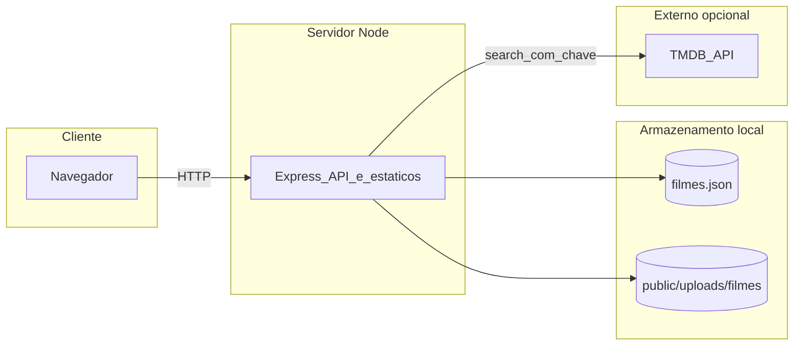

# Filmes & Séries · Nossa Lista

[](https://filmes.jcoder.com.br)

[](https://nodejs.org/)
[](https://expressjs.com/)

> *filmes & séries para assistir juntos*

Aplicação web para gerir uma **lista partilhada** de filmes e séries: adicionar títulos (com pesquisa na [The Movie Database (TMDB)](https://www.themoviedb.org/)), marcar o que já foi visto, definir previsões e observações, reordenar o que falta ver e guardar **fotos** de “momentos juntos” por título.

Interface **mobile-first** com **layout adaptado a desktop** (grelha de cartões, shell com largura máxima, modais centrados, botão “Adicionar” na barra em ecrãs largos), tema **escuro** com realce em gradiente rosa–roxo, tal como na app.

---

## Funcionalidades

### Lista e filtros

- Três abas no cabeçalho: **Para ver**, **Todos** e **Assistidos**.
- Contador no topo: `X/Y assistidos`.
- Transição suave ao mudar de aba; em dispositivos touch, **deslizar horizontalmente** alterna entre abas.

### Cartões na lista

- **Banner** com *backdrop* do TMDB (quando existir), com *shimmer* enquanto carrega.
- Badges **filme** / **série**, observação opcional, **previsão** de visionamento (apenas para pendentes) e datas (adicionado ou assistido).
- Botão circular para **marcar como assistido** (ou desmarcar) diretamente na lista.
- Na aba **Para ver**: **arrastar** pelo ícone para **reordenar** a lista (persistido no servidor).
- Na lista, **editar** e **eliminar** só para itens **ainda não assistidos**.

### Ecrã de detalhe

- Abre ao tocar num cartão; URL com hash `#/filme/:id` (partilhável).
- **Poster**, fundo com *backdrop*, título e tipo.
- Secção **Informações**: estado assistido, datas, previsão, observação, data de adição.
- Botão grande **Marcar como assistido** (com estado de carregamento).
- **Momentos juntos**: galeria de fotos (câmara ou galeria), até **40 fotos** por título, ficheiros até **8 MB**, formatos **JPEG, PNG, WebP, HEIC e HEIF**.
- Toque numa foto abre **lightbox**; botão para remover foto.
- **Editar** e **eliminar** o item só se **não** estiver assistido.

### Modais

- **Adicionar**: título com **autocomplete TMDB** (após 2+ caracteres); resultados filtrados pelo tipo (filme/série). Opcionais: previsão (data) e observação.
- **Editar**: apenas **observação** e **previsão**; título e tipo ficam bloqueados (definidos na criação).

### Outros

- **Adicionar**: em ecrãs estreitos, **FAB** (+) no canto inferior direito; em **desktop**, botão **+ Adicionar** no cabeçalho (o FAB oculta-se para evitar sobreposição com as ações dos cartões).
- **Toasts** para feedback (erros, confirmações).
- **Skeletons** no carregamento da lista e do detalhe.

---

## Stack técnica

| Camada | Tecnologia |
|--------|------------|
| Servidor | [Node.js](https://nodejs.org/) + [Express](https://expressjs.com/) |
| Persistência | Ficheiro JSON no disco |
| Uploads | [Multer](https://github.com/expressjs/multer) |
| Configuração | [dotenv](https://github.com/motdotla/dotenv) |
| Frontend | HTML, CSS e JavaScript em [public/index.html](public/index.html); [SortableJS](https://sortablejs.github.io/Sortable/) (CDN) para reordenação |
| Metadados de filmes | API TMDB (opcional, via chave) |

---

## Arquitetura



---

## Requisitos e instalação

- [Node.js](https://nodejs.org/) (recomendado: versão LTS atual).

```bash
cd filmes
npm install
npm start
```

Por defeito o servidor escuta em **http://localhost:3000**. Para reiniciar automaticamente ao editar o servidor (requer Node com suporte a `--watch`, p.ex. Node 18.11+):

```bash
npm run dev
```

---

## Variáveis de ambiente

Crie um ficheiro `.env` na raiz do projeto (não o commite com segredos).

| Variável | Descrição | Exemplo |
|----------|-----------|---------|
| `PORT` | Porta HTTP | `3000` |
| `DATA_FILE` | Caminho do JSON de dados (relativo à raiz do projeto) | `data/filmes.json` |
| `TMDB_API_KEY` | Chave da API TMDB para pesquisa ao adicionar títulos | *(obter em [TMDB](https://www.themoviedb.org/settings/api))* |

Sem `TMDB_API_KEY`, a pesquisa integrada devolve lista vazia; pode sempre introduzir títulos manualmente.

---

## API REST

| Método | Rota | Descrição |
|--------|------|-----------|
| `GET` | `/api/filmes` | Lista todos os itens |
| `POST` | `/api/filmes` | Cria item (corpo JSON: `titulo`, `tipo`, `nota`, `previsaoEm`, `tmdb_id`, `poster_path`, `backdrop_path`, …) |
| `GET` | `/api/filmes/:id` | Detalhe de um item |
| `PATCH` | `/api/filmes/:id` | Atualiza campos mutáveis (`id`, `fotos`, `adicionadoEm` não vêm do cliente). Ao marcar `assistido: true`, define `assistidoEm` se ainda não existir |
| `DELETE` | `/api/filmes/:id` | Remove item **só se não estiver assistido**; apaga pasta de uploads do item |
| `POST` | `/api/filmes/:id/fotos` | Upload multipart, campo `foto` (limite de tamanho e tipo no servidor) |
| `DELETE` | `/api/filmes/:id/fotos/:fotoId` | Remove foto e ficheiro em disco |
| `PUT` | `/api/filmes/reorder` | Corpo `{ "ids": ["id1", "id2", …] }` — nova ordem global |
| `GET` | `/api/search?q=` | Proxy TMDB (filmes + séries, resultados limitados); `q` com menos de 2 caracteres devolve `[]` |

Ficheiros estáticos servidos a partir de `public/` (incluindo `/uploads/filmes/...`).

---

## Modelo de dados (item)

Cada entrada no JSON é semelhante a:

| Campo | Tipo | Notas |
|-------|------|--------|
| `id` | string | Gerado no servidor |
| `titulo` | string | |
| `tipo` | `"filme"` \| `"serie"` | |
| `nota` | string | Observação livre |
| `assistido` | boolean | |
| `adicionadoEm` | string ISO | Definido na criação |
| `assistidoEm` | string ISO \| null | Preenchido ao marcar assistido |
| `previsaoEm` | string `YYYY-MM-DD` \| null | |
| `tmdb_id` | number \| null | |
| `poster_path` | string \| null | Caminho TMDB |
| `backdrop_path` | string \| null | Caminho TMDB |
| `fotos` | array | `{ id, url, createdAt }` — `url` servida sob `/uploads/filmes/...` |

Neste repositório, o `.gitignore` inclui `data/*.json` e `public/uploads/`, por isso dados e fotos podem não ir para o Git — faz backup local se precisares. Se o ficheiro de dados não existir, o servidor **cria** um array vazio na primeira utilização.

---

## Sistema visual (identidade da app)

Tipografia: *system UI* (`-apple-system`, `Segoe UI`, sans-serif). Tema escuro com acentos em gradiente **rosa (`#e85d9f`)** e **roxo (`#9b5de5`)**, sucesso **verde** para “assistido”.

Variáveis CSS principais (definidas em `:root` na interface):

```css
:root {
  --bg: #0f0f13;
  --surface: #1a1a24;
  --surface2: #22222f;
  --accent: #e85d9f;
  --accent2: #9b5de5;
  --text: #f0f0f0;
  --text-muted: #888;
  --watched: #2a2a38;
  --border: #2e2e42;
  --success: #4caf82;
}
```

Botões primários e realces usam `linear-gradient(135deg, var(--accent), var(--accent2))`.

---

## Estrutura do repositório

```text
filmes/
├── server.js           # API Express e ficheiros estáticos
├── package.json
├── data/               # JSON de dados (caminho configurável)
├── public/
│   ├── index.html      # UI completa (CSS + JS)
│   ├── favicon.svg
│   ├── images/         # Hero: 1.jpeg, 2.jpeg, 3.jpeg (criar localmente; ver «Imagens do hero»)
│   └── uploads/
│       └── filmes/     # Pastas por id de item (gerado em runtime)
└── README.md
```

Para manutenção futura, o CSS e o JavaScript em [public/index.html](public/index.html) podem ser extraídos para ficheiros separados (por exemplo `public/app.css` e `public/app.js`) sem alterar a API do servidor.

---

## Personalização opcional

### Imagens do hero

O bloco decorativo no topo usa três ficheiros servidos como URLs estáticos: **`/images/1.jpeg`**, **`/images/2.jpeg`** e **`/images/3.jpeg`** (ou seja, em **`public/images/`** na raiz do projeto). Se um ficheiro não existir ou falhar ao carregar, essa faixa mostra um gradiente de recurso em vez de ficar preta.

Cria a pasta `public/images/` e coloca as tuas fotos com esses nomes, ou altera os `src` em [public/index.html](public/index.html) na secção `.hero`.

### Outros

- **Favicon**: editar [public/favicon.svg](public/favicon.svg).

---

## Licença

Este repositório não define licença no `package.json`; adiciona uma licença no repositório se quiseres distribuir o código.
